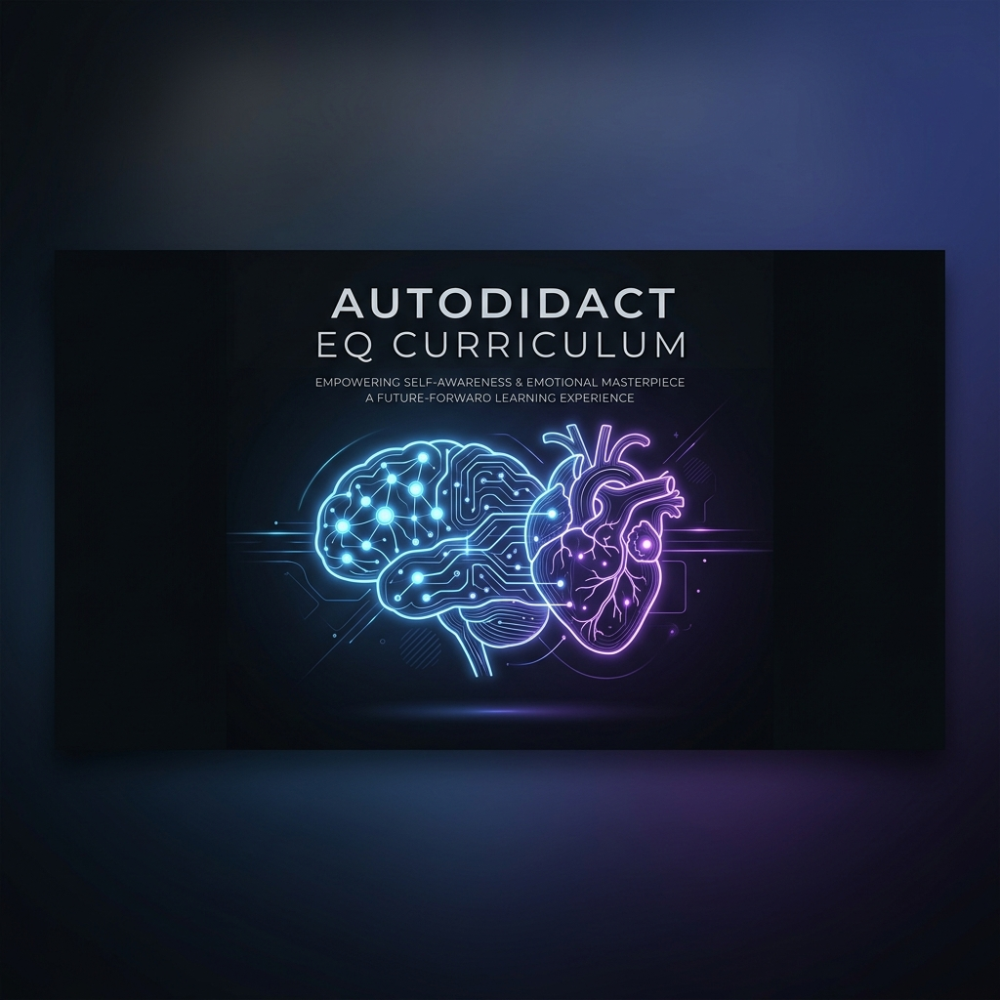

# 🧠 Autodidact EQ Curriculum (Otopratik Duygusal Zeka Müfredatı)

Bu repo, duygusal zekayı (EQ) teorik bir bilgi yığını olmaktan çıkarıp, bir mühendislik disiplini gibi sistemli bir şekilde geliştirmeyi hedefleyen açık kaynaklı bir müfredattır.

# 🎯 Temel Felsefe

Müfredatımızın temel felsefesi 3 ana sütun üzerinde yükselir:

1. **Teori Pratiğe Tabiidir:** Sadece psikoloji kitapları okumak EQ'nuzu artırmaz. Öğrenilen her teorik model, sahada (gerçek insan etkileşimlerinde) test edilmeli ve sonuçları analiz edilmelidir.
2. **Geri Bildirim Döngüsü (Feedback Loop):** Sosyal başarısızlıklar, reddedilmeler veya öfke patlamaları birer yıkım değil; sistemin zayıf noktalarını gösteren "hata raporlarıdır (bug report)". Bu veriler, sistemi güncellemek için kullanılır.
3. **Sürekli İyileştirme (CI/CD Mantığı):** EQ gelişimi bir varış noktası değil, ömür boyu süren bir yolculuktur. Sistem her gün yeni verilere maruz kalmalı ve kendini yeniden yapılandırmalıdır.

---

## 🛠️ Ön Koşullar (Prerequisites)

Bu müfredata başlamadan önce aşağıdaki zihinsel kurulumların (mindset) tamamlanmış olması şarttır:

* **Radikal Şeffaflık:** Kendinize yalan söylemeyi bırakmalısınız. Hatalarınızı ve zayıf yönlerinizi objektif bir şekilde kabul etme cesareti.
* **Ego İzolasyonu:** Öğrenme süreci boyunca egoyu bir kenara bırakıp, geri bildirimleri kişisel bir saldırı olarak değil, birer veri noktası olarak algılama yetisi.
* **Sıfır Beklenti:** Diğer insanların değişmesini beklemeyi bırakıp, yalnızca kendi reaksiyonlarınızı ve sisteminizi optimize etmeye odaklanma.

---

## 🗺️ Müfredat Yapısı (Syllabus)

Eğitim programı, bireyin kendi iç dünyasından başlayarak adım adım dış dünyaya ve karmaşık sosyal sistemlere doğru genişleyen 4 ana modülden oluşmaktadır.

### [Modül 1: Öz-Farkındalık Katmanlı (Self-Awareness Layer)](Module-1-Self-Awareness/)
Kişinin kendi içsel işletim sistemini şeffaf bir şekilde okuyabilmesi, tüm EQ inşasının temelidir. Tanımlanamayan bir sorun, çözülemez.

* **[1.1 Duygu Granülerliği (Emotion Granularity)](Module-1-Self-Awareness/1.1-Emotion-Granularity.md):** Kötü veya iyi hissetmenin ötesine geçerek duyguları yüksek çözünürlükte isimlendirme (örn: "Kötü hissediyorum" yerine "İzole edilmiş ve yetersiz hissediyorum").
* **[1.2 Tetikleyici Haritalaması (Trigger Mapping)](Module-1-Self-Awareness/1.2-Trigger-Mapping.md):** Sizi aniden öfkelendiren, korkutan veya savunmaya geçiren dış etkenlerin kök neden (root cause) analizi.
* **[1.3 Durum Loglama (State Logging)](Module-1-Self-Awareness/1.3-State-Logging.md):** İçsel durumların (internal states) dışarıdan bakan tarafsız bir gözlemci gibi, yargılamadan kaydedilmesi.
* **Modül Çıktısı:** Birey, kendi duygusal dalgalanmalarının haritasını çıkarabilir ve "Şu an tam olarak ne hissediyorum ve neden?" sorusuna anında yanıt verebilir hale gelir.

### [Modül 2: Öz-Düzenleme Protokolleri (Self-Regulation Protocols)](Module-2-Self-Regulation/)
Fark edilen duyguyu yönetme, yıkıcı dürtüleri durdurma ve sistemi stabil tutma sanatıdır.

* **[2.1 Tepki Latansını Artırma (Response Latency)](Module-2-Self-Regulation/2.1-Response-Latency.md):** Etki (uyarıcı) ile tepki (aksiyon) arasındaki milisaniyelik süreyi uzatarak amigdala korsanlığını (amygdala hijack) önleme teknikleri. (örn: 3 saniye kuralı).
* **[2.2 Yüksek Stres Altında Regülasyon](Module-2-Self-Regulation/2.2-High-Stress-Regulation.md):** Kriz, kaos ve çatışma anlarında bilişsel kapasiteyi (prefrontal korteks) devrede tutmak için sinir sistemi dengeleme pratikleri.
* **[2.3 Bilişsel Yeniden Çerçeveleme (Cognitive Reframing)](Module-2-Self-Regulation/2.3-Cognitive-Reframing.md):** Negatif durumları felaketleştirmeden, objektif gerçeklik zemininde çözülebilir mühendislik problemleri olarak yeniden yapılandırma.
* **Modül Çıktısı:** Birey, dış dünyadan gelen ağır tahriklere karşı reaktif (dürtüsel) davranmak yerine proaktif ve stratejik yanıtlar üretir.

### [Modül 3: Bilişsel ve Duygusal Empati (Empathy & Data Parsing)](Module-3-Empathy-Data-Parsing/)
Dış dünyadaki aktörlerin yaydığı karmaşık veri akışını doğru ve önyargısız işleme yetisidir.

* **[3.1 Mimari Dinleme (Architectural Listening)](Module-3-Empathy-Data-Parsing/3.1-Architectural-Listening.md):** Karşınızdakini sadece sıranızı beklemek için değil; onun anlam dünyasını, değerlerini ve kullandığı mantık silsilesini kavramak için dinleme.
* **[3.2 Mikro-İfadeler ve Alt Metin Analizi](Module-3-Empathy-Data-Parsing/3.2-Micro-Expressions.md):** Söylenen kelimelerin ötesine geçerek beden dili, mikro-mimikler, ses tonu ve söylenemeyenler üzerinden veri toplama.
* **[3.3 Çift Yönlü Perspektif (Perspective-Taking)](Module-3-Empathy-Data-Parsing/3.3-Perspective-Taking.md):** Kendi doğrularınızdan vazgeçmeden, bir konuya tamamen karşı tarafın zihinsel modelinden (mental model) bakabilme esnekliği.
* **Modül Çıktısı:** Birey, karşısındaki insanın niyetini ve ihtiyaçlarını, o kişi henüz bunları dile getiremeden okuyabilme kapasitesine ulaşır.

### [Modül 4: Sosyal Etkileşim Sistemleri (Social System Architecture)](Module-4-Social-System-Architecture/)
Kazanılan içsel gücü ve dışsal okuma yeteneğini, gerçek dünyada sürdürülebilir, sağlıklı ve verimli ilişkilere dönüştürme evresidir.

* **[4.1 Çatışma Çözümü (Conflict Resolution)](Module-4-Social-System-Architecture/4.1-Conflict-Resolution.md):** Tartışmaları ego savaşlarından (kazan-kaybet) çıkarıp, ortak bir düşmana (probleme) karşı yürütülen bir beyin fırtınasına dönüştürme.
* **[4.2 Güvenlik Duvarı Mimarisi (Boundary Setting)](Module-4-Social-System-Architecture/4.2-Boundary-Setting.md):** Nezaketi ve profesyonelliği kaybetmeden net bir "Hayır" diyebilme; toksik kişi ve durumlara karşı ihlal edilemez kişisel sınırlar çizme.
* **[4.3 Yapıcı Geri Bildirim Döngüsü](Module-4-Social-System-Architecture/4.3-Constructive-Feedback.md):** İnsanlara, onları savunmaya geçirmeden sistemlerini iyileştirecek eleştiriler sunabilme ve dışarıdan gelen ağır eleştirileri filtreleyerek faydalı veriyi çıkarabilme.
* **Modül Çıktısı:** Birey, zorlu sosyal çevrelerde saygı uyandıran, güven veren ve krizleri fırsata çeviren bir liderlik profili çizer.

---

## 📈 Başarı Metrikleri (KPIs)

Gelişiminizi ölçebilmeniz için sistemin önceki ve sonraki versiyonlarını kıyaslayan gösterge tablosu:

| Durum | Düşük EQ Tepkisi (Eski Sürüm) | Yüksek EQ Tepkisi (Güncel Sürüm) |
| :--- | :--- | :--- |
| **Eleştiri Almak** | Savunmaya geçmek, karşı saldırmak veya küsmek. | "Bu eleştirideki haklılık payı nedir?" diyerek veriyi analiz etmek. |
| **Hata Yapmak** | Suçu başkasına/şartlara atmak veya kendini kırbaçlamak. | Hatanın kök nedenini bulup sistemi güncellemek. |
| **Fikir Ayrılığı** | Kendi fikrini bağırarak veya zorla kabul ettirmeye çalışmak. | Karşı tarafın neden o fikri savunduğunu merak edip sorular sormak. |
| **Stresli Anlar** | Paniklemek, dürtüsel kararlar almak. | Duraksamak, nefesi düzenlemek ve büyük resmi görmek. |

---

## 📖 Reponun Kullanım Kılavuzu

1. **Sıralı İlerleme:** Modülleri atlamayın. Öz-farkındalık (Modül 1) altyapısı kurulmadan atılan Sosyal Etkileşim (Modül 4) adımları manipülasyona dönür ve çöker.
2. **Commit ve Push:** Her gün sonu, o günkü duygusal reaksiyonlarınızı kendi kişisel not defterinize (veya fork'ladığınız repo'nuza) kaydedin. Nerede iyiydiniz, nerede patladınız?
3. **Sahada Test:** Burada okuduğunuz her bir prensibi ertesi gün işte, okulda veya ailenizle olan bir konuşmada bilinçli olarak uygulayın.

---

## 🤝 Katkı Sağlama (Contributing Guidelines)

Bu müfredat tek bir yazarın değil, kolektif bir zekanın ürünü olmayı hedefler. EQ gelişimi konusunda işe yaradığını sahada test edip kanıtladığınız bir makale, bir nefes tekniği, psikolojik bir model veya kitap önerisi varsa:

1. Bu repoyu fork'layın.
2. Yeni pratikleri ilgili modülün altına ekleyin.
3. Açıklayıcı bir metinle **Pull Request (PR)** gönderin.

Bilgiyi sistemleştirin ve demokratikleştirin. İyi güncellemeler.